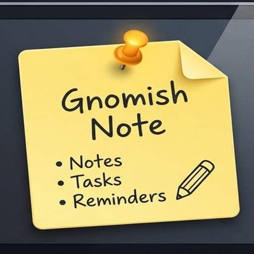
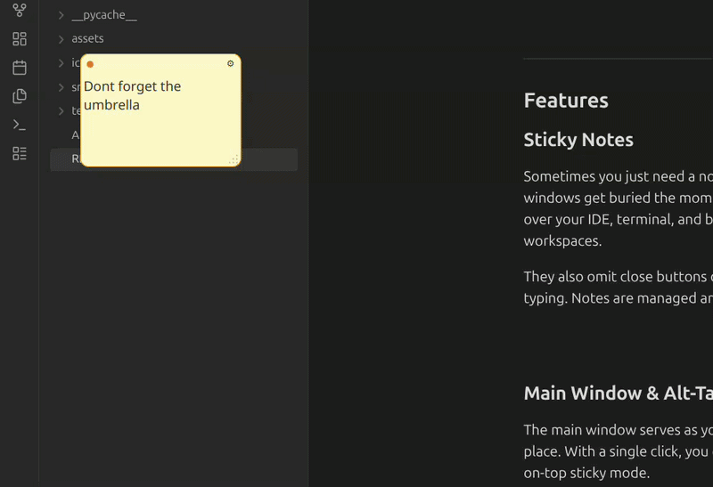
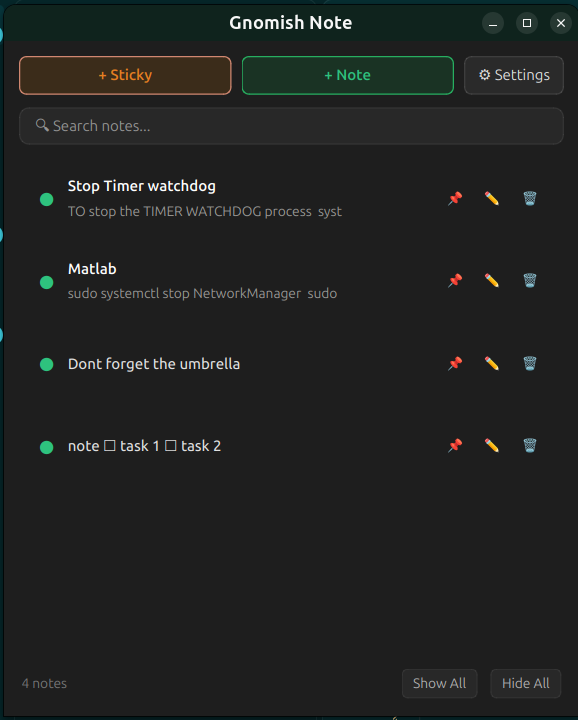
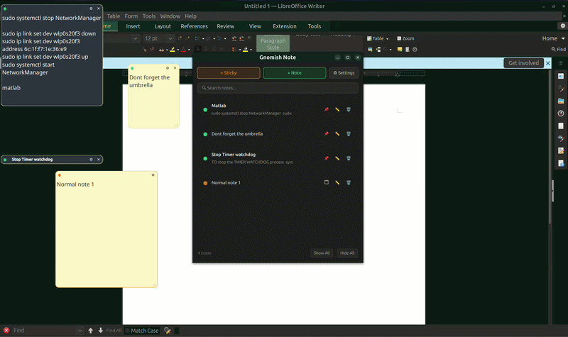
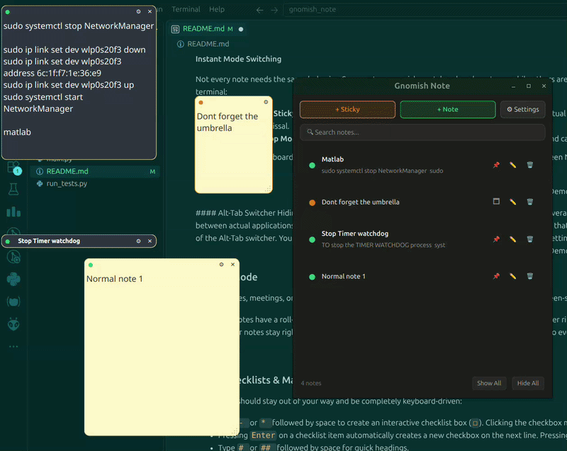
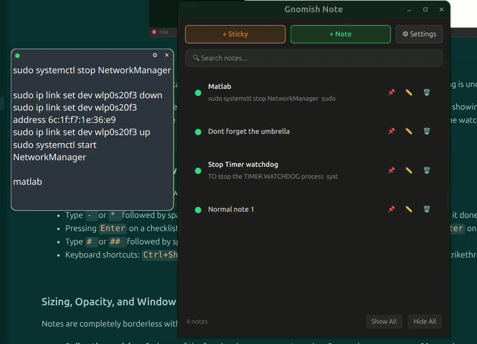
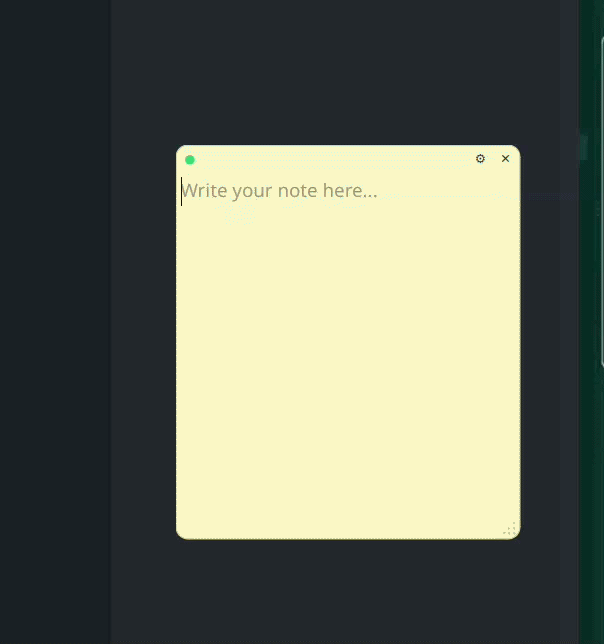
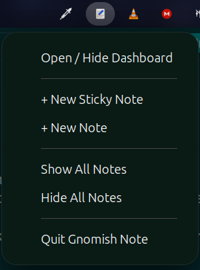

<div align="center">



# Gnomish Note

A fast, lightweight sticky note and desktop scratchpad built for GNOME on Linux (Wayland and X11) that can make the notes stay on top, and hide them from alt-tab switcher.

[](https://python.org)
[](https://riverbankcomputing.com/software/pyqt/)
[](https://www.gnome.org/)
[](LICENSE)

<br/>

</div>

---

## Features

### Sticky Notes
I needed important things always visible on screen so I wouldn't forget them — deadlines, quick reminders, whatever needed to stay in front of me.

Sticky notes float over everything, stay pinned across all GNOME workspaces, and have no close button — so you can't accidentally kill one while typing. Notes are deleted from the main window only.

<p align="center">
  
</p>

### Main Window & Mode Switching
The main window serves as the CRUD interface. It is hidden by default on startup and can be summoned anytime from the top panel indicator or by launching Gnomish Note from your app grid. Persistent themes for the notes can also be set from the settings. 

<p align="center">
  
</p>

#### Alt-Tab Switcher Hiding
I didn't want to cycle through 10 note windows every time I needed to get back to my browser. Gnomish Note includes a companion GNOME Shell extension that keeps sticky notes on your screen but out of the Alt-Tab switcher entirely. You can install, verify, or remove the extension from the settings dialog.

<p align="center">
  
</p>

#### Instant Mode Switching
Not all notes are emergencies. Some are normal things to remember. Normal notes sit on your current workspace and don't float over everything. Sticky notes do. You can switch any note between the two modes from the dashboard without losing anything.

<p align="center">
  
</p>


### Roll-Up Mode
During classes and presentations, my private notes kept showing up on screen while I was sharing. To fix this, notes have a roll-up mode: double-click the top bar and the note collapses into a slim ribbon showing only the title. Double-click again to expand back.

<p align="center">
  
</p>

### Quick Checklists & Markdown
I needed to track the day's to-do list. Notes support interactive checkboxes, headings, and strikethrough — all keyboard-driven, no toolbar.
- `-` or `*` for checkboxes, click to mark done. 
- `#`and `##` for simple headers

<p align="center">
  
</p>

### Sizing, Opacity, and Window Controls
Notes are borderless. Resize from any edge or corner — corners have larger hit zones so precision can jump out the window. Opacity goes from 40% to 100% so you can read what's under a note. Click any overlapping note to bring it to front, order is saved across restarts.

<p align="center">
  
</p>

---

## Shortcuts Reference

| Shortcut | Context | Action |
| :--- | :--- | :--- |
| `Ctrl+Shift+C` | Note Editor | Toggle interactive checklist on current line |
| `Ctrl+Shift+X` | Note Editor | Toggle strikethrough formatting |
| `Enter` | Checklist Item | Auto-insert new checkbox on next line |
| `Enter` | Empty Checkbox | Exit checklist mode |
| `Double-Click` | Note Header | Collapse note into roll-up ribbon / Expand back |
| `Escape` | Settings Popover | Dismiss settings popover |

---

## Installation & Setup

### Option 1: Standalone Binary (Recommended)
Download the latest pre-compiled Linux binary from [GitHub Releases](https://github.com/Stup702/Gnomish-Note/releases/latest):

```bash
# Make the downloaded binary executable and run
chmod +x gnomish-note
./gnomish-note
```
*(On first run, Gnomish Note automatically installs its icon and registers a desktop launcher in `~/.local/share/applications/` so you can launch it directly from your GNOME App Grid).*

### Option 2: Run from Source
If you prefer running directly with Python:
- **OS**: Linux with GNOME 45, 46, 47, or 48+ (Wayland or X11)
- **Runtime**: Python 3.10+
- **Dependencies**: PyQt6

```bash
# Clone the repository
git clone https://github.com/Stup702/Gnomish-Note.git
cd Gnomish-Note

# Install dependencies and run
pip install PyQt6
python3 main.py
```

### Option 3: Build Binary from Source
To compile your own standalone single-file executable using PyInstaller:
```bash
python3 build_binary.py
./dist/gnomish-note
```

---

## Automated Tests

Includes a test suite of the bugs I had to face during development and some use cases I thought would occur.
Uses mock storage isolation and headless rendering to not mess up actual notes. 
```bash
python3 run_tests.py
```

## Future Plans
- Add note lock system
- Add note organization feature to the main window

## License & Credits

- **License**: [GPL-3.0 License](LICENSE)
- **Inspiration**: Special thanks to [koter84/AltTabHide](https://github.com/koter84/AltTabHide) for the GNOME Shell Alt-Tab filtering concepts.
- **Framework**: Built with [PyQt6](https://www.riverbankcomputing.com/software/pyqt/).
